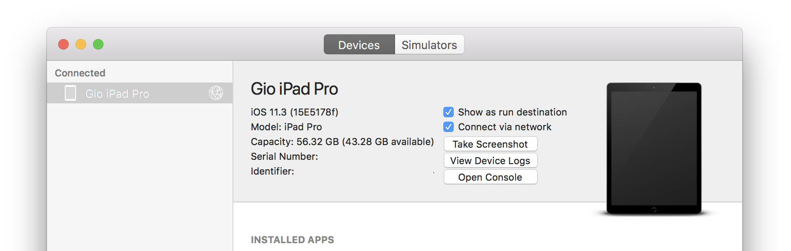

#### AmbeoAADemo is an ARKit iOS app demonstrating the AMBEO Augmented Audio Developer's Kit.

The [AMBEO Smart Headset](https://en-us.sennheiser.com/in-ear-headphones-3d-audio-ambeo-smart-headset) (**"ASH"**) is a binaural recording headset with a host of unique features that make it a perfect hardware complement to Augmented Audio applications.

---

# Controls

# The ASH App 

While the ASH can be controlled from the physical unit shown above, deeper features are available through its dedicated iOS app ("Sennheiser AMBEO® SmartHeadset"), which you can find for free on the app store.

# Debugging While Using the ASH

Because the ASH connects to your iOS device via lightning port, you must install/run/debug your app over WiFi.

1. Connect both your device and your Mac to the same WiFi network.

1. Connect your device via USB to your Mac.

2. Navigate to **Window** menu and select **Devices and Simulators**.

3. Under the **Devices** tab, select your device from the **Connected** section.

4. Select the **Connect via network** checkbox.

You should now see network status icon beside your device name:

You can now disconnect your device USB, and install/run/debug your app wirelessly, while the AMBEO Smart Headset is connected.

---

Please direct any questions or comments to our team via <Ambeo-Info@sennheiser.com>

---
