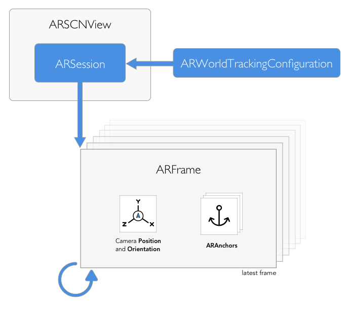

---

# Contents

- [AmbeoAADemo: The Basics](#ambeoaademo-the-basics)
  - [Requirements](#requirements)
  - [How to Play](#how-to-play)
  - [User Interface](#user-interface)
- [AmbeoAADemo: Technical Overview](#ambeoaademo-technical-overview)
  - [AmbeoARSCNView](#ambeoarscnview)
  - [ViewController](#viewcontroller)
  - [Plane Detection and Interaction](#plane-detection-and-interaction)
  - [Additional View Controllers](#additional-view-controllers)
  - [VirtualObject](#virtualobject)
  - [Virtual Acoustic Environment](#virtual-acoustic-environment)
- [Using LeiaAU](#using-leiaau)
  - [(0) The LeiaAU Audio System Organization](#0-the-leiaau-audio-system-organization)
  - [(1) LeiaAUAppExtension](#1-leiaauappextension)
  - [(2) LeiaAUFramework](#2-leiaauframework)
    - [(2.1) LeiaAUFramework: LeiaAUViewController](#21-leiaauframework-leiaauviewcontroller)
    - [(2.2) LeiaAUFramework: LeiaAU](#22-leiaauframework-leiaau)
  - [(3) AmbeoAADemo: The Host App](#3-ambeoaademo-the-host-app)
- [AmbeoAAEngine](#ambeoaaengine)
  - [Recording AmbeoAAEngine Audio](#recording-ambeoaaengine-audio)
  - [Processing AMBEO Smart Headset Audio](#processing-ambeo-smart-headset-audio)
- [Credits](#credits)
---

# AmbeoAADemo: The Basics

`AmbeoAADemo` is an iOS app demonstrating use of the **ASH** and **Leia** from the Augmented Audio Developer's Kit. `AmbeoAADemo` runs an [ARKit][0] world tracking session with content displayed in a SceneKit view. It uses the [LeiaAU](#using-leiaau) 3D audio rendering system.

[0]:https://developer.apple.com/documentation/arkit

## Requirements

##### Build

- macOS   >= 10.13.2
- Xcode   >= 9.3
- iOS SDK >= 11.3
- "Leia" Binaural Rendering Engine library (_libSennheiserAmbeoLeia.a_)

##### Runtime

- iOS device with an A9 (or later) processor, running iOS 11.3 (or later)

> **NOTE**: ARKit is not available in iOS Simulator

## How to play

After launching the app, move the camera around to identify your first surface. The "Focus Square" in the center of the screen shows information about the state of surface tracking:
- *Blue corners*: you are identifying your first surface
- *Blue square*: you have identified a new surface
- *Gray square*:  you are looking at an existing surface, or the surface has expanded from newly-identified feature points
- *Gray corners*: you are identifying a new surface

For ARKit to detect features, you must be looking at content that has plenty of interesting features to detect. Things that will cause poor feature identification are:
- *Bad lighting* — insufficient light or too much light with reflections or specular highlights.
- *Lack of texture* — if we point the camera at a white wall, there is nothing unique that ARKit can identify, so it won’t be able to find or track it. Avoid looking at areas of solid colors, shiny surfaces, and so on.

Now that you have at least one surface identified, begin placing instruments with the  button. Instruments are placed on the surface that the Focus Square is currently focused on. After placement, you can move the object around the surface with one finger, or rotate it with two fingers.

Then, simply press the  button, and interact with your instruments as they perform.

## User Interface

 Show the LeiaAU control panel.

 Show the AMBEO Smart Headset controls.

 Toggle Debug Mode.
- Expose the geometries of identified surfaces, and enable additional debugging tools. (Floor is dark blue, horizontal surfaces are light blue, and vertical surfaces are red).

 Add/Remove LeiaAU Source (i.e. a `VirtualObject`).
- Present a popover menu of available sound sources.

 Show/Hide the virtual acoustic room environment, and enable:
-  Manually measure the room height.   
-  Assign materials to room surfaces.   
-  Prevent the room environment from being automatically updated.

 /  Start or stop the `AmbeoAAEngine`.
- This also starts or stops audio recording (see "[Recording AmbeoAAEngine Audio](#recording-ambeoaaengine-audio)").

 Reset the entire experience.

---

# AmbeoAADemo: Technical Overview

The AmbeoAADemo demo relies on `SceneKit`. SceneKit is a high-level 3D graphics framework that allows us to create 3D animated scenes and effects in ARKit apps. It incorporates a physics engine, a particle generator, and ways to script the actions of 3D objects so we can describe our scene in terms of its content — geometry, materials, lights, and cameras — and then animate it by describing changes to those objects.

The `ARSCNView` class is a SceneKit view that includes an `ARSession` object, which manages the motion tracking and image processing required to create an AR experience. To run our ARSession, we first provide it with an `ARWorldTrackingConfiguration`. ARConfigurations can change the origin and orientation of the coordinate system with respect to the real world (see `worldAlignment`). Note that, by default, ARKit uses world and camera coordinate systems following a right-handed convention: the positive `y` points upward, positive z-axis points toward the viewer and the x-axis points toward the viewer's right.

To establish a correspondence between real and virtual spaces, ARKit uses a technique called _visual-inertial odometry_. A running ARSession continuously captures video frames from the `ARCamera` (the standard camera of the device). For each frame, ARKit analyzes the image together with data from the device's motion sensing hardware to estimate the device's real-world position. ARKit delivers this tracking information and imaging parameters in the form of an `ARFrame` object.

An `ARFrame` also contains a list of `ARAnchor` objects, which embody real-world positions and orientations that can be used for placing objects in our AR scene. Because we enable the `planeDetection` setting in our ARWorldTrackingConfiguration, ARKit will automatically detect flat surfaces in the camera image, add ARAnchors, and report their position and sizes. Note that each ARAnchor in an ARSession defines its own local coordinate system, also following the right-handed SceneKit convention.

Additionally, with each new `ARFrame` we update the listener (user) position and orientation. This takes place in the `renderer(_:updateAtTime:)` function of `ViewController+Delegate` (more on this below). Note that, in **AmbeoAADemo**, we derive the lister orientation from the iOS device's orientation itself. This makes for the most simple orientation tracking. However, it is the least accurate and least realistic method, and is not usable for "audio-only" applications that have no visual component. For those applications that require a higher level of orientation tracking, use the [AMBEO External Headtracker](Documentation/README_Headtracker.md) instead.

### AmbeoARSCNView

`AmbeoARSCNView` is a custom `ARSCNView` configured for the requirements of AmbeoAADemo. It provides additional helper functions for performing hit tests to find objects or planes.

### ViewController

The AmbeoAADemo demo app centers around our primary ViewController, [`ViewController.swift`](x-source-tag://ViewController).  This is the foundation of the app’s internal structure. It manages the primary user interface and the interactions between that interface and our underlying data. It also facilitates transitions between different parts of our user interface (see the `Additional View Controllers` group). This ViewController's functionality is subdivided and managed by the following extensions:

[`ViewController`](x-source-tag://ViewController) - _The main view controller (MVC) for our AR experience_
- `ViewController+Actions` - _UI Actions for the MVC_
- `ViewController+Delegate` -  _ARSessionDelegate and ARSCNViewDelegate interactions for the MVC_
- `ViewController+Environment` -  _Virtual acoustic environment interactions for the MVC_
- `ViewController+Gestures` -  _Coordinates gesture interactions with the AmbeoARSCNView and VirtualObjects_
- `ViewController+ObjectSelection` - _Methods on MVC for handling virtual object loading and movement_

### Plane Detection and Interaction

The [`FocusSquare`](x-source-tag://FocusSquare) class draws a square outline in the AR view, giving the user hints about the status of ARKit world tracking. The FocusSquare changes size to reflect estimated scene depth, and switches between open and closed states with a prominent animation to indicate whether ARKit has detected a plane suitable for placing an object (see `renderer(_:didAdd:for:)` in `ViewController+Delegate`). The FocusSquare disappears after the user places an object in the scene, and reappears when the user points the camera away from the object.

The objects we place are represented by the `VirtualObject` class. A VirtualObject encapsulates an `SCNNode` we attach to the scene, including its position, rotations, and other transforms. Each unique `VirtualObject` is also associated with several assets and a corresponding sound source in `LeiaAU` (more in this later in [VirtualObject](#virtualobject)).

To place or interact with VirtualObjects in our AR scene, we use hit-test results (`SCNHitTestResult`) and our detected planes found from real-world surfaces corresponding to a point in the camera image. See the `ViewController+Gestures.swift` for implementations of the gesture interactions available in AmbeoAADemo, such as one-finger dragging to move an object and two-finger rotation to spin the object.

Some further notes about gestures: We map touch gestures into a restricted space so the user can more easily control results. Touch gestures are inherently two-dimensional, but an AR experience involves the three dimensions of the real world. As such, we can consider limiting object dragging to the two-dimensional plane that the object rests on (however, if a plane represents the ground or floor, it often makes sense to ignore the plane's extent while dragging). Furthermore, we limit object rotation to a single axis at a time (in this demo, each object rests on a plane, so the object can rotate around a vertical axis). Finally, we prevent the user from resizing virtual objects with a pinch gesture, as a virtual object inhabits the real world more convincingly when it has an intuitive, intrinsic size. Additionally, a user may become confused as to whether they're resizing an object or changing its depth relative to the camera position. Finally, while the user is dragging a `VirtualObject`, we smooth the changes in its position so that it doesn't appear to jump while moving (see `updateVirtualObjectPosition()`).

### Additional View Controllers

- `AshSettingsViewController` manages the programmatic configuration of AMBEO Smart Headset features and parameters.   
- `VirtualObjectSelectionViewController` handles the selection, or deselection, of a `VirtualObject`.   
- `VirtualMaterialSelectionViewController` presents all available `VirtualMaterial` options for selection.

### VirtualObject

A `VirtualObject` completely encapsulates an object that is placed and interacted with in the demo. Any interaction with a `VirtualObject` (such as creation, removal, or movement) updates not only the "physical" node itself in the `AmbeoARSCNView`, but also a corresponding **Leia** 3D audio engine sound source.

A `VirtualObject` is identified by a particular `VirtualObjectConfig`, which includes a specification of its display name, associated icon graphic, associated 3D model asset file, associated audio files, and valid alignments within the `AmbeoARSCNView`. The `VirtualObjectLoader` creates each unique `VirtualObject` by parsing these fields from the `VirtualObjects.json` file.

Specifically, a `VirtualObject` is a subclass of `SCNReferenceNode`, which is an `SCNNode` that references an external file. In this case, the file referenced is a particular `.scn` 3D model asset located under `Resources/Models.scnassets`. This model gives the `VirtualObject` its visual "body" in the `AmbeoARSCNView`.

As mentioned above, a `VirtualObject` can also be thought to encapsulate a unique sound source for the **Leia** 3D audio engine. Specifically, it contains a unique `AVAudioPlayerNode`, an array of valid `AVAudioFiles`, and a unique `LeiaAU` source ID. The `AVAudioPlayerNode` sends audio from an `AVAudioFile` to a particular input bus of `LeiaAU` within the `AmbeoAAEngine` (more about this in the next section, [Using LeiaAU](#using-leiaau)).

Taking a closer look at the `.scn` asset corresponding to a `VirtualObject` such as the guitar, note that in the Scene Graph there is a `LeiaAUSource` sphere geometry ("bubble") around part of the musical instrument. This bubble informs `LeiaAU` of two things:

1. The exact location point from where sound should be emitted (the center of the bubble).
2. The minimum distance gain limit of the source (the radius of the bubble). In other words, the loudness of the sound source will not change (be limited) for the listener when they are located inside of the bubble.

### Virtual Acoustic Environment

The **Leia** 3D audio rendering engine also supports a virtual acoustics environment in the form of a "shoebox"-shaped room (for more specific information, consult the Leia README). Control is exposed in the **AmbeoAADemo** through the  button. The app constructs a best-fit shoebox room around the extent of your lowest horizontal plane identified (the "floor").

Move the device around your room until it has identified the true extent of your floor, then determine the height of your walls manually with the  button, and finally "lock" your virtual acoustic room in place with the  button. By pressing the  button and tapping surfaces of the room, you can assign different `VirtualMaterials` with unique acoustic qualities. Note that any updates to the room (such as position, orientation, height, or materials) are reflected in a corresponding **Leia** audio engine environment.

A `VirtualMaterial` includes a specification of its display name, its associated **Leia** audio engine material name, and a `.png` mesh file located in `Resources/Assets.xcassets/VirtualMaterials`. The `VirtualMaterialDatabase` parses these fields from the `VirtualMaterials.json` file, and exposes an array containing all `VirtualMaterials`.

---

# Using LeiaAU

AmbeoAADemo incorporates Sennheiser's AMBEO **"Leia"** 3D audio rendering system as an Audio Unit App Extension. An Audio Unit App Extension has two main elements: the audio unit proper, and a user interface. The audio unit itself (`LeiaAU`) is a custom plug-in that encapsulates the **Leia** binaural audio rendering engine, while the user interface can be used to control and monitor this audio unit. As a whole, this AMBEO Augmented Audio system is comprised of three parts:

1) **The App Extension**

2) **The LeiaAU 3D Audio Engine Framework**

3) **The Containing Host App**

### (0) The LeiaAU Audio System Organization

### (1) LeiaAUAppExtension

**LeiaAUAppExtension** is a bundle with a filetype extension `.appex`, which Xcode builds into an app's `PlugIns` directory. It links against the `LeiaAUFramework`, and allows us to use the **"Leia"** 3D audio rendering system in our ARKit app. It's associated audio unit is `LeiaAU`, and its custom user interface can be viewed in `LeiaAUAppExtension/MainInterface.storyboard`.

### (2) LeiaAUFramework

`LeiaAUFramework` is a shared framework that is linked into both the containing host app (in this instance, `AmbeoAADemo`) and the extension, so that both can use the audio unit and its user interface.

#### (2.1) LeiaAUFramework: LeiaAUViewController

The [`LeiaAUViewController`](x-source-tag://LeiaAUViewController) is the app extension's principal class, responsible for creating and managing both the audio unit and its view. Whenever the LeiaAUAppExtension is created or loaded, the system will create an instance of this principle class. When it is instantiated, a `LeiaAU` audio unit is created independently and passed to the view controller, which then "connects" all the view parameters with the audio unit.

#### (2.2) LeiaAUFramework: LeiaAU

The heart of the framework, the actual processing and Audio Unit v3 implementation, is the `LeiaAU` class (AUAudioUnit subclass). It is initialized in `initWithComponentDescription()` and `allocateRenderResources()`, and its processing block is `internalRenderBlock()`.

### (3) AmbeoAADemo: The Host App

The `LeiaAU` 3D audio plugin cannot exist without a host app, such as AmbeoAADemo. This app contains the plugin, and links against the `LeiaAUFramework`.

**AmbeoAADemo** uses the `AmbeoAAEngine` to connect `LeiaAU` to input and output devices within the app.

---

# AmbeoAAEngine

The [`AmbeoAAEngine`](x-source-tag://AmbeoAAEngine) can manage the audio I/O of host apps, such as AmbeoAADemo. It manages a group of connected `AVAudioNodes` in an `AVAudioEngineGraph`. These nodes are linked through input and output busses. An array of `AVAudioPlayerNodes` (owned by corresponding [`VirtualObjects`](x-source-tag://VirtualObject)) carries source audio to `LeiaAU`, then to an `AVAudioMixerNode`, and ultimately to the hardware output:

Whenever a [`VirtualObject`](x-source-tag://VirtualObject) is placed in the AR scene, the host app adds it to the AmbeoAAEngine as well. This VirtualObject's unique `AVAudioPlayerNode` sends audio from an `AVAudioFile` to an open input bus of `LeiaAU`. At the time of this writing, a single `LeiaAU` input bus can contain only 1 (mono) channel of audio.

`LeiaAU` then takes the audio from these input busses as input for the AMBEO **Leia** binaural rendering engine, executes the internal rendering process, and produces a binaural (stereo) output. Note that, while the number of inputs to `LeiaAU` can be entirely arbitrary, you _must set the maximum possible number of sources to be rendered at compile time_, with the `MAX_NUM_SOURCES` parameter in `LeiaAU.mm`

The output of `LeiaAU` is then sent to the `AVAudioMixerNode`. This then sends audio to the `AVAudioOutputNode`, which will ultimately deliver it to the hardware output (i.e. the user's Ambeo Smart Headset or headphones).

## Recording AmbeoAAEngine Audio

By default, each time the user taps  , the `AmbeoAAEngine` will begin recording the output of `LeiaAU` and the **AMBEO Smart Headset** ("ASH") microphones.

`AmbeoAAEngine` also includes a simple demonstration of how to write the audio output from `LeiaAU` (_"Augmented"_) and/or the audio from the **AMBEO Smart Headset** microphones (_"Reality"_) to file(s). This is shown with two different approaches.

To record the **AMBEO Smart Headset** ("ASH"), we use an `AVAudioRecorder`, which takes the binaural (stereo) signal from the ASH microphones via an `AVAudioInputNode`, and writes it to the file `recordingASH.caf` in the app's __AppData/Documents__ directory.

To record the Augmented Audio output of `LeiaAU`, we install an `AVAudioNodeTapBlock` on the `AVAudioMixerNode`, and continually writes the given `AVAudioPCMBuffer` to `recordingAA.caf`. When the engine stops, the file is finished, and available in the app's __AppData/Documents/__ directory as well.

By default, these recording processes begin each time the user taps , and stop when they tap . Note that, as written, these files will be overwritten each time. You can then access the resulting files via iTunes File Sharing, like so:

## Processing AMBEO Smart Headset Audio

Perhaps your application requires the ability to process the "real-world" audio experience of the user. For example, if you are exploring Hearable technology and want to apply some custom environment-specific equalization, or if you are developing an educational application to simulate the experience of tinnitus by applying some filtering in realtime.

This can be done by manipulating the existing `AmbeoAAEngine`'s `AVAudioEngineGraph`. In this case, you must connect the `AVAudioInputNode` to the input of your desired processing unit(s), and the output of the unit(s) to an available input bus of the mixer node (and thus ultimately the engine output).

There are a few important points to keep in mind in this situation. Firstly, note that you should use a substantially low `FRAME_COUNT` in `LeiaAU` to minimize latency. Furthermore, you should **disable the Transparent Hearing feature on the AMBEO Smart Headset itself**, and replace it with your processed audio instead.

It is important to remember that the AMBEO Smart Headset has local Transparent Hearing processing that _does not interface with the iOS device_. This is what you activate with the
Control Module on the device itself. This results in the best Transparent Hearing performance with the least latency possible, and is what you should use if your application _does not_ require processing of the ASH. If it does, you must follow the procedure above.

# Credits

The stem recordings in the AmbeoAADemo application are from the track "GOOMB (Get Off of My Back)" by artist Playing Savage. 

Check out more great music by **Playing Savage**:
 - https://playingsavage.com/
 - https://www.facebook.com/PlayingSavageMusic/

Check out **Seayou Records** and their growing catalogue of fresh music:
- http://www.seayourecords.com/

---

Please direct any questions or comments to our developer team by posting them as 'issues' on this GitHub repository.

---
