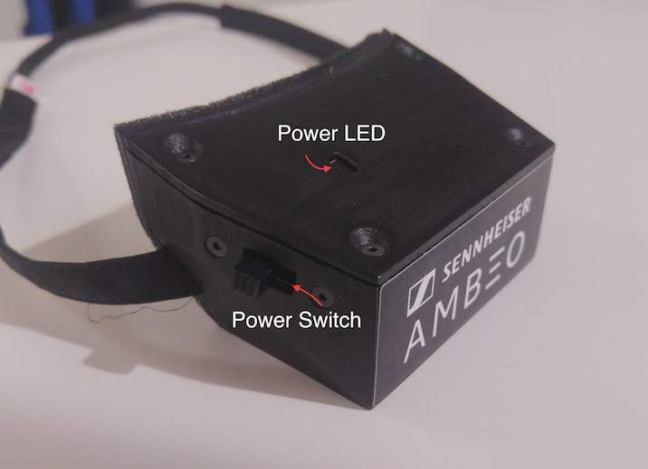
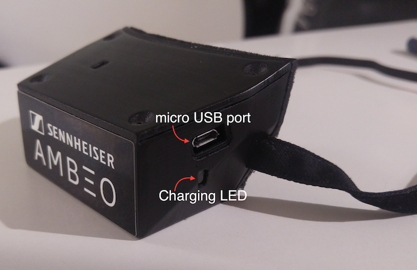
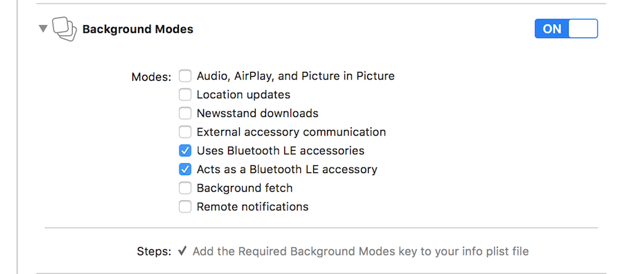
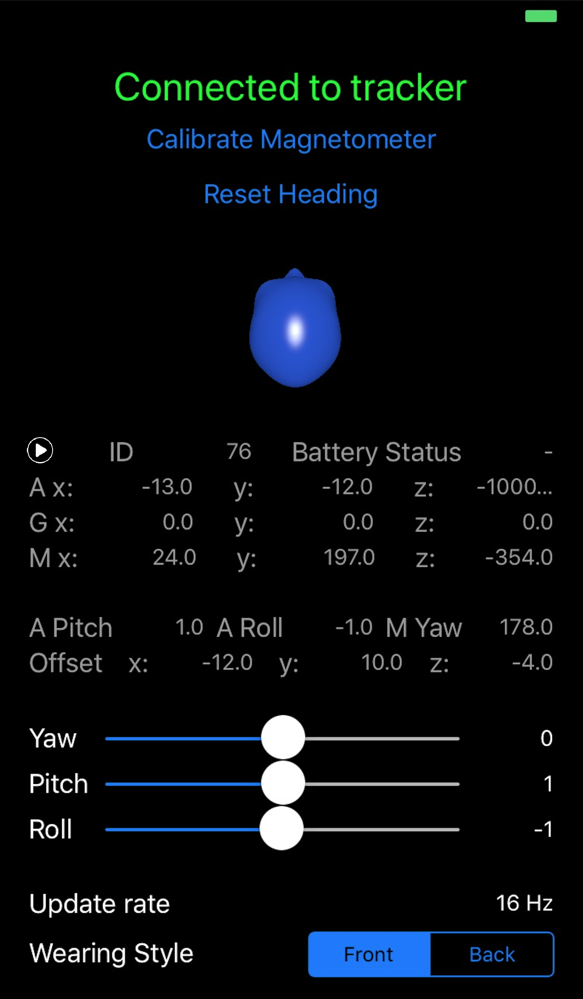
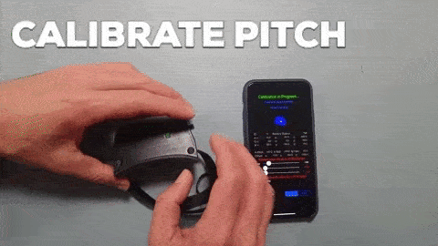
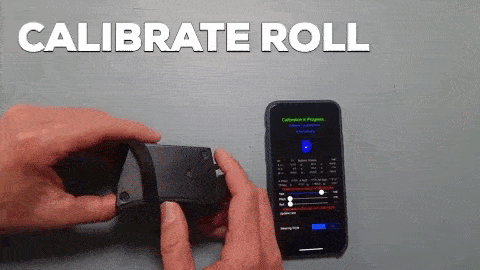
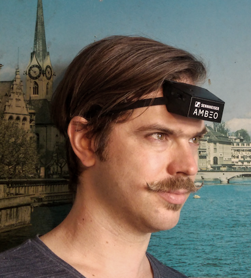
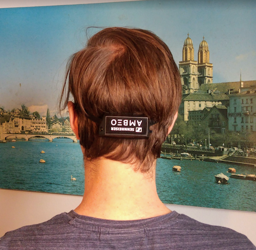
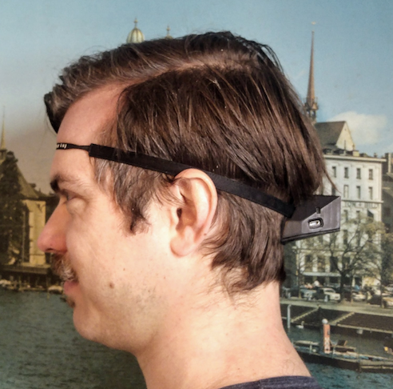

# Ambeo Prototype Headtracker

The AMBEO Headtracker is a prototype designed for use in the AMBEO Augmented Audio Developers Program (AAADP).


## Hardware Overview
The hardware of the headtracker is based around an Arduino platform and transmits data wirelessly via a Bluetooth Low Energy (BTLE) connection. The device contains 3 sensors, whose data is combined to deliver the orientation data:
* Accelerometer
* Gyroscope
* Magnetic Sensor

The update rate over the BTLE connection is roughly `15 Hz`, a limitation imposed by the Arduino platform.

### Turning on the Headtracker
It is crucial that the headtracker is lying flat on a surface when it is turned on with the switch. For this step, the tracker should be placed in such a way that the side of the enclosure with the power LED is on the top.



### Charging & Power
The unit runs on batteries, which provide a use time of more than 3 hours. The batteries are charged via the micro USB port on the side. Charging time is approximately 90 minutes. The LED next to the USB port lights up red while the unit is charging, and turns to green when fully charged.



## Software Overview - API
The headtracker is accessed via the provided Swift framework `BLEHeadtracker.framework`.

To receive data from the headtracker, the client application must instantiate `BLETrackerReceiver` and register a class as a delegate that conforms to the  `BLETrackerReceiverDelegate` protocol:

```swift
public protocol BLETrackerReceiverDelegate {
  func updateStatus(status: String, updateRate: String, validData: Bool, isCalibrating: Bool)
  func updateRawData(id: Int32, trackerRawData : TrackerRawDataType)
  func updateAttitude(yaw: Double, pitch: Double, roll: Double)
}
```

The instance of `BLETrackerReceiver` provides the following functions:

```swift
/** Resets the heading of the headtracker, defining 0° as its current yaw orientation. */
public func resetHeading()

/** Starts the calibration process for the headtracker */
public func resetCalibration()

/** Returns false while the yaw angle is being calibrated, true when calibration is finished. */
public func isYawCalibrated() -> Bool

/** Returns false while the pitch angle is being calibrated, true when calibration is finished. */
public func isPitchCalibrated() -> Bool

/** Returns false while the roll angle is being calibrated, true when calibration is finished. */
public func isRollCalibrated() -> Bool

/** Configures whether the tracker is mounted on the front or the back of the user's head. */
public func setTrackerMountingPosition(position : TrackerMounting)
```

### Background Modes
The application must have Bluetooth LE capabilities enabled under "Background Modes":



### Example Application: HeadTrackerReceiver_iOS
The included iOS application `HeadTrackerReceiver_iOS` serves both as an example on how to receive tracker data through the API, as well as a useful diagnostic utility. Using this application, the headtracker can also be calibrated. The application is entirely written in Swift 4.1.

The application shows the raw measurement values (useful for debugging) as well as the current Yaw, Pitch and Roll angles that represent the head orientation.

Also, the application plays a burst of white noise every 2 seconds when the "play" button (on the left side above the sensor data) is played. When the headtracker is configured correctly, this noise should remain in a static position in space when moving (your head with) the headtracker.
In code, this feature shows how to (minimally) instantiate Leia within a AudioUnit and interface it with the headtracker data.



### Calibration Procedure
The headtracker needs to be calibrated at least once after unboxing and should be re-calibrated when the *magnetic environment* undergoes major changes.
The calibration values are persisted in the application using Apple's `UserDefaults`
All this happens within the `BLETrackerReceiver` object.

> NOTE: If the headtracker is used in conjunction with headphones with strong magnets, the calibration procedure should be performed with these headphones.


To calibrate the headtracker using the example application, place the headtracker flat on the surface and press the `Calibrate Magnetometer`

1) Slowly rotate the headtracker over the _yaw_ axis (as shown in the animation) until the number for the _yaw_ slider turns white:


2) Slowly rotate the headtracker over the _pitch_ axis (as shown in the animation) until the number for the _pitch_ slider turns white:



3) Slowly rotate the headtracker over the _roll_ axis (as shown in the animation) until the number for the _roll_ slider turns white:



When the numbers for all 3 sliders are white, the calibration procedure is completed.


### Wearing Styles
The headtracker can be worn in two ways. Both work equally well - depending on user preference and additional accessories involved in the experience one or the other wearing style   might be superior.

A) On the front of the user's head:



B) On the back of the user's head (Note that the AMBEO headtracker must be worn "upside-down" in this configuration, i.e. the power LED will be pointing downwards):


